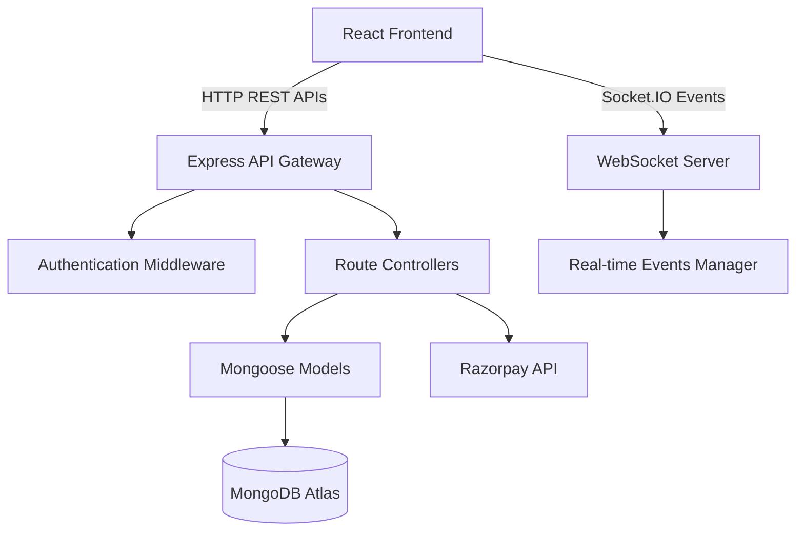
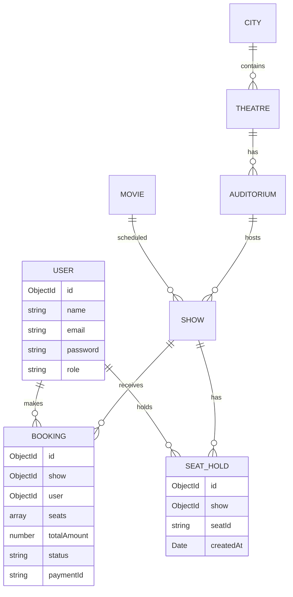
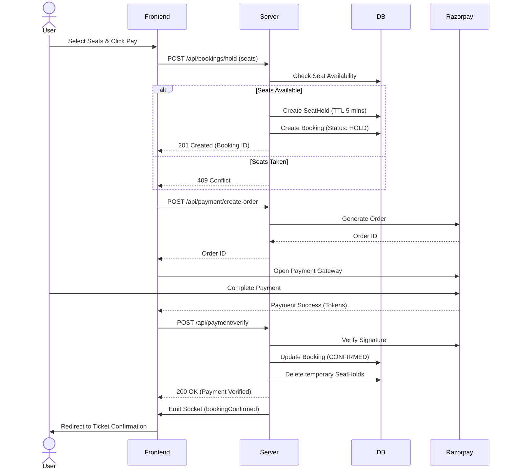

# Architecture Diagrams

## 1. System Architecture

```mermaid
graph TD
    Client[React Frontend] -->|HTTP REST APIs| API[Express API Gateway]
    Client -->|Socket.IO Events| Socket[WebSocket Server]
    API --> Auth[Authentication Middleware]
    API --> Controllers[Route Controllers]
    Controllers --> Models[Mongoose Models]
    Models --> DB[(MongoDB Atlas)]
    Controllers --> Payment[Razorpay API]
    Socket --> Events[Real-time Events Manager]
```

## 2. Entity Relationship Diagram (ERD)

```mermaid
erDiagram
    USER ||--o{ BOOKING : makes
    USER ||--o{ SEAT_HOLD : holds
    CITY ||--o{ THEATRE : contains
    THEATRE ||--o{ AUDITORIUM : has
    MOVIE ||--o{ SHOW : scheduled
    AUDITORIUM ||--o{ SHOW : hosts
    SHOW ||--o{ BOOKING : receives
    SHOW ||--o{ SEAT_HOLD : has

    USER {
        ObjectId id
        string name
        string email
        string password
        string role
    }
    
    BOOKING {
        ObjectId id
        ObjectId show
        ObjectId user
        array seats
        number totalAmount
        string status
        string paymentId
    }

    SEAT_HOLD {
        ObjectId id
        ObjectId show
        string seatId
        Date createdAt
    }
```

## 3. Sequence Diagram (Booking Flow)

```mermaid
sequenceDiagram
    actor User
    participant Frontend
    participant Server
    participant DB
    participant Razorpay

    User->>Frontend: Select Seats & Click Pay
    Frontend->>Server: POST /api/bookings/hold (seats)
    Server->>DB: Check Seat Availability
    alt Seats Available
        Server->>DB: Create SeatHold (TTL 5 mins)
        Server->>DB: Create Booking (Status: HOLD)
        Server-->>Frontend: 201 Created (Booking ID)
    else Seats Taken
        Server-->>Frontend: 409 Conflict
    end

    Frontend->>Server: POST /api/payment/create-order
    Server->>Razorpay: Generate Order
    Razorpay-->>Server: Order ID
    Server-->>Frontend: Order ID

    Frontend->>Razorpay: Open Payment Gateway
    User->>Razorpay: Complete Payment
    Razorpay-->>Frontend: Payment Success (Tokens)

    Frontend->>Server: POST /api/payment/verify
    Server->>Razorpay: Verify Signature
    Server->>DB: Update Booking (CONFIRMED)
    Server->>DB: Delete temporary SeatHolds
    Server-->>Frontend: 200 OK (Payment Verified)
    Server->>Frontend: Emit Socket (bookingConfirmed)
    Frontend->>User: Redirect to Ticket Confirmation
```
